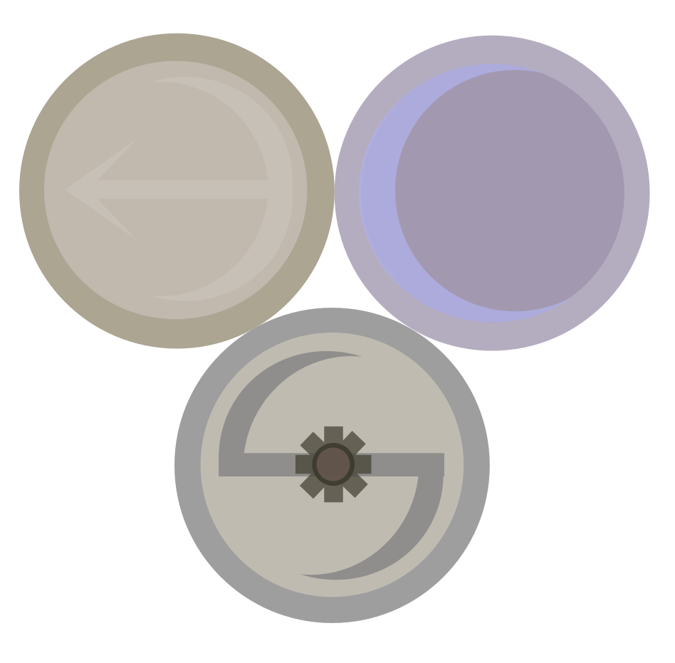

# Baedoor Creation Set
> **The Isle of Ansur**

---

**Baedoor Creation Set** is mod editor created with purpose of helping players to mod
Baedoor games.  
This repository contains its version aimed on **The Isle of Ansur** game and being
created exlusively towards its modding system.

Currently, there is no documentation for BCS software, as well as The Isle of Ansur.  
The software itself is in `indev` stage and is also being rewritten from Python to Nim,
as an experimental endeavour.

---
Please stay tuned!