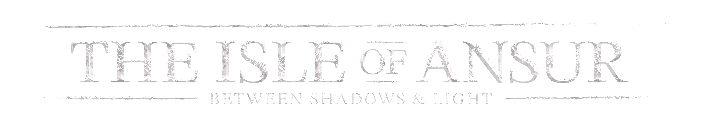

# The Isle of Ansur

---
The Isle of Ansur is text-based RPG game, being remaster of my old terminal game taking place
in my own steampunk/fantasy universe, Baedoor.

Unlike original, it is made with graphical interface, trying to be accessible and much
more advanced technologically.  
Despite its oldschool character, The Isle of Ansur tries to improve on mechanics I find
too static in the genre and support modding extensively.

# Current Progress Status

---
The Isle of Ansur is currently in:

> **pre-alpha** 

This means game is not usable by any means. This doesn't mean you cannot download
developer's builds or report issues, though - it's really welcome to participate in
such early state of the game!

Current gameplay features:
- Creation of your own character (it can be saved for future updates gameplay)
- Modding support (related to character creation)

To have ~~spoilers~~ sneak-peek into development process, you can look into issues page.  
Milestones/bulk topics let me organise and discuss next steps in what I code into the game.  
Feel free to share your thoughts or report bugs there.

# Links

---

**Download early builds:** https://github.com/Toma400/The_Isle_of_Ansur/releases

**Github:** https://github.com/Toma400/The_Isle_of_Ansur

**Discord:** https://discord.gg/GbTw9KqnrE

# Modding

---
**Mods Repository:** [**GitHub page**](https://github.com/Toma400/Isle_of_Ansur_Mods_Repository/blob/library/Modlist.md)

**Docs:** [**Jump to file!**](modding_guide.pdf) (a little outdated, but should work)

# Translations
Translations are currently handled as mods, so they have small limitations, but can
be easily contributed into. Completed translations will be merged into the game at
later stage of development.  
Feel free to contribute!

**Polish:** [**GitHub page**](https://github.com/Toma400/The_Isle_of_Ansur_PL)

# Contribution

---
Currently, you can contribute to open-sourced translation mods listed in [section above](#translations).

Contributions for other features are currently closed.
You can reach to developer by pull request or contacting directly, but it will
most likely be rejected.  
For anyone who would like to contribute anyway, here are principles that should be followed:

- **[Principles For Code Contribution](https://github.com/Toma400/The_Isle_of_Ansur/wiki/Code-Contribution-Principles)**  
- **[Principles For Assets Contribution](https://github.com/Toma400/The_Isle_of_Ansur/wiki/Assets-Contribution-Principles)**

In next months quest contributions will be opened, when most of game features are in place.

# Credits

---
**Lead Developer:** Toma400  
**QA:** [skeletontonguedworld](https://github.com/skeletontonguedworld)

---
All resources used are under [Baedoor License](license) unless stated in [credits](credits.md).